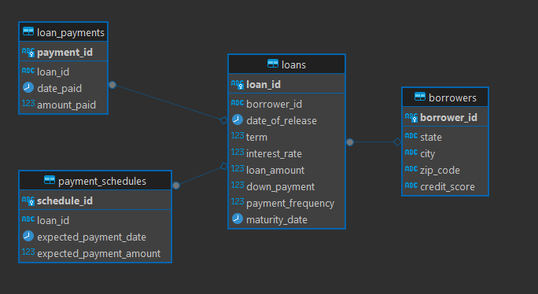
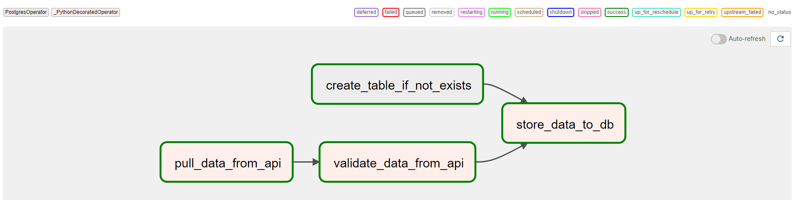
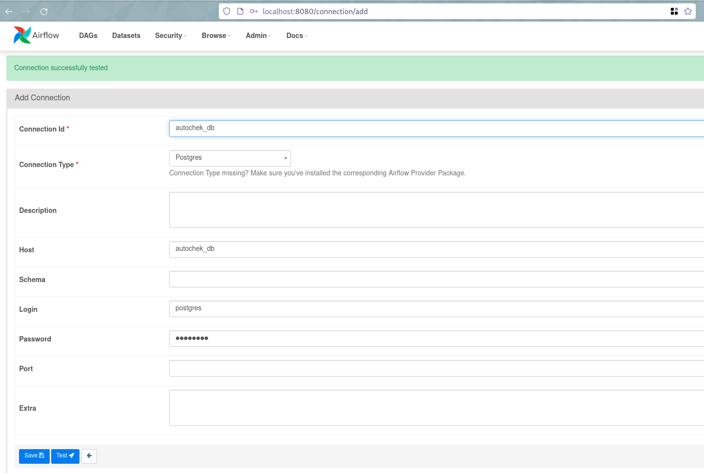
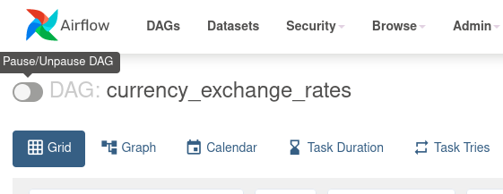
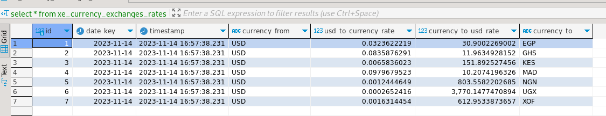

# Problem 1: Extraction of Loans Status Report (SQL)
As requested, we needed to extract a status reports for all the **Loans**.

The report can be found [problem_1/loans_status_report-2023-Nov-11.xlsx]("problem_1/loans_status_report-2023-Nov-11.xlsx")

Here is an overview of the ER Diagram of the tables provided:




## Get Started
To launch the instance for testing, you can follow the below steps:

1. Make sure you have [docker](https://www.docker.com/) & [docker-compose](https://docs.docker.com/compose/)  install, then the below command:
```bash
cd problem_1
docker-compose -f docker-compose-p1.yaml up
```

2.  Next you can access the database on the below `localhost` port `5435` with the user & password as **`postgres`** (Unless changed in [docker-compose.yaml](docker-compose-p1.yaml)) and select database **`autochek_db`**.

3. To facilitate the extraction the report, I created a `view` with the [query](problem_1/sql/solution.sql). Run the below query in your preferred PostgreSQL client to get the report:
```sql
select *
from view_loans_status_report;
```

## Details
I used SQL to extract the data with the below query:
```sql
-- Loans Status Report
with
ps_data as ( -- payment_schedules
	select loan_id, expected_payment_date as last_expected_payment_date, total_expected_payment_amount
	from (
		select ps.*,
			row_number() over(partition by loan_id order by expected_payment_date desc) as row_n,
			sum(expected_payment_amount) over (partition by loan_id order by expected_payment_date) as total_expected_payment_amount
		from payment_schedules ps
		where expected_payment_date <= now() -- The status today 
	) a
	where row_n = 1 -- Get last date ONLY
),
lp_data as ( -- loan_payments
	select loan_id, date_paid as last_date_paid, total_amount_paid
	from (
		select 
			lp.*,
			row_number() over(partition by loan_id order by date_paid desc) as row_n,
			sum(amount_paid) over (partition by loan_id order by date_paid) as total_amount_paid
		from loan_payments lp
		where date_paid <= now() -- The status today
	) a
	where row_n = 1 -- Get last date ONLY
)
select 
	loans.loan_id,
	loans.borrower_id,
	loans.date_of_release,
	loans.term,
	loans.loan_amount,
	loans.down_payment,
	borrowers.state,
	borrowers.city,
	borrowers.zip_code,
	loans.payment_frequency,
	loans.maturity_date,
	(lp.last_date_paid::date - ps.last_expected_payment_date::date) as current_days_past_due,
	ps.last_expected_payment_date as last_due_date,
	lp.last_date_paid as last_repayment_date,
	(ps.total_expected_payment_amount - lp.total_amount_paid) as amount_at_risk,
	borrowers.credit_score as borrower_credit_score,
	lp.total_amount_paid,
	ps.total_expected_payment_amount
from loans 
left join ps_data ps on loans.loan_id = ps.loan_id
left join lp_data lp on lp.loan_id = loans.loan_id
left join borrowers on borrowers.borrower_id = loans.borrower_id
```

## Observations:
- **The table `missing_payments` is not in the document**. I created the report without it.
- The below columns were not in the document & data provided:
  ```
  branch
  branch_id
  borrower_name  
  ```
- The `borrower_credit_score` for the second borrower is the letter `a`. Maybe a typo.


# Problem 2: Script that Pull data from XE API (Python):
The opjective is to pull Currency Exchange rates twice a day from XE API. 

I used [Apache Airflow](https://airflow.apache.org) to schedule the pipeline.

Here is an overview of the pipeline:



## Get Started
To launch the instance for testing, you can follow the below steps:

1. We need to create and `.env` from [sample.env](./sample.env):
```bash
cp problem_2/sample.env problem_2/.env
```
2. Add the Xe API_ID & API_KEY in the `.env` file as below:
```bash
XE_API_ID=''
XE_API_KEY=''
```

3. Make sure you have [docker](https://www.docker.com/) & [docker-compose](https://docs.docker.com/compose/)  install, then the below command:
```bash
cd problem_2
docker-compose -f docker-compose-p2.yaml up
```

5. You can access the Apache airflow on this [link](http://localhost:8080) with the user & password as **`airflow`**.

6. Create a new Postgres connection with the id as **`autochek_db`** (will be used to store the currency data results) as below:


7. Go to the Dags interface and enable the `currency_exchange_rates` DAG:


8. Next you can access the database on `localhost` port `5433` with the user & password as **`postgres`** and select database **`postgres`**

9. Run the below query in your preferred PostgreSQL client to get the rates in the designated format.
```sql
select *
from xe_currency_exchanges_rates;
```


